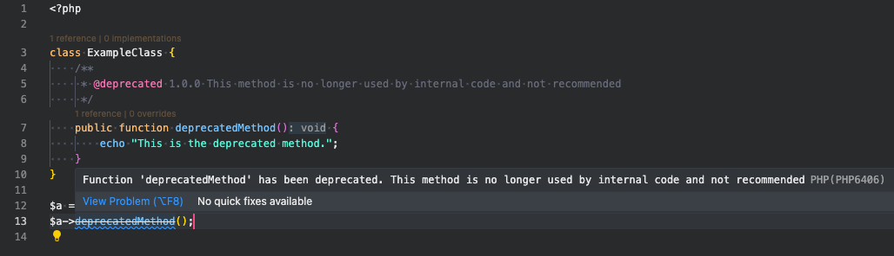

# PHP 8.4 news

PHP 8.4 đã được phát hành vào ngày 21 tháng 11 năm 2024.
Phiên bản này sẽ bao gồm các property hooks, hỗ trợ HTML 5 cũng như các phương thức nối tiếp mà new không cần thêm dấu ngoặc đơn — và nhiều thay đổi lớn!

Dưới đây là một số tính năng chính mà tôi tóm tắt được

---

## Property hooks

Các Property hooks được lấy cảm hứng từ các ngôn ngữ như Kotlin, C# và Swift.
Property hooks sẽ giúp loại bỏ mẫu của các phương thức get và set thuộc tính, cho phép thuộc tính xác định quyền truy cập và cập nhật bằng hook.

```php
<?php

class User
{
    public function __construct(
        public string $firstName,
        public string $lastName
    ) {}

    public string $fullName {
        // Override the "read" action with arbitrary logic.
        get => "{$this->firstName} {$this->lastName}";

        // Override the "write" action with arbitrary logic.
        set {
            [$this->firstName, $this->lastName] = explode(' ', $value, 2);
        }
    }

    public function getName()
    {
        return 
    }
}

$user1 = new User('tea', 'my');
echo $user1->fullName; // tea my

$user1->fullName = 'Trà My';
echo $user1->firstName; // Trà
echo $user1->lastName; // My
```

---

## Asymmetric Visibility - Khả năng hiển thị không đối xứng

Bắt đầu từ PHP 8.4, các thuộc tính cũng có thể có khả năng hiển thị của chúng được thiết lập không đối xứng với phạm vi đọc và ghi khác nhau.

Cú pháp của sẽ như sau:

```php
{read visibility} {set visibility}(set) {propertyType} $name;
```

Ví dụ:

```php
<?php

class Book
{
    public function __construct(
        public private(set) string $title,
        public protected(set) string $author,
        protected private(set) int $publicYear,
    ) {}
}

$b = new Book('PHP news', 'Tm', 2024);

echo $b->title; // PHP news
echo $b->author; // Tm
echo $b->publicYear; // Fatal error: Uncaught Error: Cannot access protected property Book::$publicYear in ...
echo $b->title = "Php 8.4 news"; // Fatal error: Uncaught Error: Cannot modify private(set) property Book::$title from global scope in...
```

Do $title và #publicYear được define là private(set) nên nó chỉ được phép ghi trong chính class Book.
Các phương thức con và instance khi ghi đè sẽ dẫn đến một Fatal error

```php

class SpecialBook extends Book
{
    public function updateAuthor(string $author): void
    {
        $this->author = $author;
    }

    public function updatePublicYear(int $year): void
    {
        $this->publicYear = $year;
    }
}

$a = new SpecialBook('PHP news', 'Tm', 2024);
$a->updateAuthor('abc');
echo $a->author; // abc
$a->updatePublicYear(2025); // Fatal error: Uncaught Error: Cannot modify private(set) property Book::$ from scope SpecialBook in ...
```

Asymmetric Visibility phải tuân theo các quy tắc sau:

1. Nếu không cung cấp khả năng hiển thị khi đọc thì mặc định sẽ là public.
2. Set (ghi) khả năng hiển thị luôn được theo sau bởi chuỗi "(set)"
3. Khả năng hiển thị khi ghi PHẢI bằng hoặc ít hiển thị hơn khả năng hiển thị khi đọc
4. Khi kết hợp với các hook thuộc tính, khả năng hiển thị sẽ áp dụng cho các hook get và set tương ứng.
5. Asymmetric Visibility yêu cầu thuộc tính phải có khai báo kiểu dữ liệu.

---

## #[\Deprecated] Attribute

PHP 8.4 giới thiệu một tính năng mới là #[\Deprecated] Attribute, được sử dụng để đánh dấu các class, hàm, phương thức hoặc thuộc tính là không nên sử dụng nữa (deprecated).
Tính năng này giúp cải thiện quá trình bảo trì mã nguồn bằng cách cung cấp cảnh báo tại thời điểm chạy mà không cần sử dụng PHPDoc hoặc các phương pháp thủ công khác.

Trong php < 8.4, ta phải sử dụng cú pháp @deprecated trong PHPDoc như sau:

```php
<?php

class ExampleClass {
    /**
     * @deprecated 1.0.0 No longer used by internal code and not recommended
     */
    public function deprecatedMethod() {
        echo "This is the deprecated method.";
    }
}

$a = new ExampleClass();
$a->deprecatedMethod();
```

Ví dụ trên sẽ giúp các editor hiển thị một cảnh báo rằng function bị đánh dấu là deprecated kể từ phiên bản 1.0.0, có thể bị xoá ở các phiên bản sau và sẽ không được khuyến khích sử dụng nữa.

Tuy nhiên, khi code được chạy, sẽ không có bất cứ cảnh báo nào được bắn ra(xem hình bên dưới).

Trong php >= 8.4, ta làm như sau:

```php
<?php

class ExampleClass {
    #[\Deprecated(
        message: "This method is no longer used by internal code and not recommended",
        since: "1.0.0",
    )]
    public function deprecatedMethod() {
        echo "This is the deprecated method.";
    }
}

$a = new ExampleClass();
$a->deprecatedMethod();
```

Editor cũng sẽ hiển thị cảnh báo giống như ở phiên bản php < 8.4.
Tuy nhiên, khi code được thực thi, một cảnh báo lỗi với level E_USER_DEPRECATED sẽ được bắn ra.

```text
Deprecated: Method ExampleClass::deprecatedMethod() is deprecated since 1.0.0, This method is no longer used by internal code and not recommended in /Users/manh.nguyen3/Work/test-php-8.4.1.php on line 14
This is the deprecated method.
```

---

## Tính năng ext-dom mới và hỗ trợ HTML5

Mặc dù HTML 5 đã ra đời hơn từ năm 2008, nhưng PHP chưa bao giờ có hỗ trợ phù hợp cho nó.
PHP có \DOMDocument, về mặt lý thuyết sẽ hỗ trợ HTML 4, nhưng nó không thực sự tương thích với HTML 4 nữa.

Để khắc phục những điểm kỳ quặc này: PHP 8.4 đang bổ sung trình phân tích cú pháp tương thích với HTML 5!

Xem chi tiết tại [bài viết này](https://stitcher.io/blog/html-5-in-php-84).

---

## Object API cho BCMath

PHP 8.4 giới thiệu Object API cho BCMath, một cách mới để làm việc với các phép toán số học chính xác cao (arbitrary precision) thông qua các đối tượng thay vì chỉ sử dụng các hàm như trước đây.
Điều này giúp mã trở nên hướng đối tượng, dễ đọc và quản lý hơn, đặc biệt trong các ứng dụng phức tạp.

Xem thêm tại [Rfc này](https://wiki.php.net/rfc/support_object_type_in_bcmath).

---

## Thêm các hàm mới cho array

Các hàm mới:

- [array_find](https://www.php.net/manual/en/function.array-find.php)(array $array, callable $callback): mixed - Trả về phần tử đầu tiên thỏa mãn hàm callback
- [array_find_key](https://www.php.net/manual/en/function.array-find-key.php)(array $array, callable $callback): mixed - Trả về khóa của phần tử đầu tiên thỏa mãn hàm callback
- [array_any](https://www.php.net/manual/en/function.array-any.php)(array $array, callable $callback): mixed - Kiểm tra xem có ít nhất một phần tử mảng thỏa mãn hàm callback hay không
- [array_all](https://www.php.net/manual/en/function.array-all.php)(array $array, callable $callback): mixed - Kiểm tra xem tất cả các phần tử mảng có thỏa mãn hàm callback không

---

## PDO driver specific subclasses

Trong PHP 8.4, tính năng PDO Driver-Specific Subclasses được giới thiệu nhằm tăng tính rõ ràng và hỗ trợ đặc thù khi làm việc với các cơ sở dữ liệu qua PDO (PHP Data Objects).
Thay vì sử dụng lớp chung PDO, các driver (như MySQL, SQLite, PostgreSQL) có các lớp con riêng biệt, giúp truy cập các phương thức hoặc tính năng đặc trưng của từng driver một cách an toàn và rõ ràng hơn.

Trước PHP 8.4, PDO cung cấp một API chung cho tất cả các driver cơ sở dữ liệu.
Dù các driver hỗ trợ các tính năng đặc thù, bạn vẫn phải sử dụng lớp chung PDO, dẫn đến việc thiếu gợi ý từ IDE hoặc gặp lỗi runtime khi gọi các phương thức không hỗ trợ.

```php
$pdo = new PDO('mysql:host=localhost;dbname=test', 'user', 'password');

// Không rõ driver nào được sử dụng
$pdo->getAttribute(PDO::ATTR_DRIVER_NAME);
```

Từ PHP 8.4, PDO giới thiệu các lớp con đặc thù tương ứng với từng driver, chẳng hạn:

- PDO\Dblib
- PDO\Firebird
- PDO\MySQL
- PDO\Odbc
- PDO\Pgsql
- PDO\SQLite

Điều này giúp:

- Gợi ý phương thức đặc thù của driver từ IDE.
- An toàn hơn khi làm việc với các tính năng chỉ hỗ trợ bởi một driver cụ thể.

---

## new MyClass()->method() không có dấu ngoặc đơn

Vì member access trong quá trình khởi tạo đã được giới thiệu, bạn phải đóng gói lệnh new MyClass() trong dấu ngoặc đơn, nếu không bạn sẽ gặp lỗi phân tích cú pháp.
Cú pháp được đề xuất sẽ cho phép bạn truy cập các hằng số, thuộc tính và phương thức mà không cần thêm dấu ngoặc đơn:

```php
class PhpVersion
{
    public function getVersion(): string
    {
        return 'PHP 8.4';
    }
}
// php < 8.4 
var_dump((new PhpVersion())->getVersion());

// php >= 8.4 
var_dump(new PhpVersion()->getVersion());
```

Bản cập nhật này sửa lỗi papercut giúp việc truy cập thành viên lớp trở nên đơn giản hơn, không cần phải thêm dấu ngoặc đơn bao quanh hoặc sử dụng phương thức khởi tạo tĩnh.
Thay đổi cú pháp này cũng giúp PHP phù hợp hơn với các ngôn ngữ C khác như Java, C# và TypeScript, vốn không yêu cầu dấu ngoặc đơn bao quanh.

## Lazy Objects

Lazy Objects - một cải tiến giúp tối ưu hóa hiệu suất và quản lý bộ nhớ bằng cách trì hoãn việc khởi tạo đối tượng cho đến khi nó thực sự cần được sử dụng.
Điều này đặc biệt hữu ích trong các ứng dụng lớn, nơi mà một số đối tượng có thể không được sử dụng ngay lập tức hoặc thậm chí không được sử dụng trong suốt quá trình thực thi.

### Lazy Objects là gì?

- **Lazy Object**: Là một đối tượng được "đại diện" bởi một proxy (lazy proxy).
Proxy này sẽ trì hoãn việc khởi tạo thực tế của đối tượng gốc cho đến khi một thuộc tính hoặc phương thức của nó được truy cập.
- Giúp giảm chi phí tài nguyên ban đầu khi khởi tạo đối tượng.

### **Lợi ích của Lazy Objects**

1. **Tăng hiệu suất**:

- Giảm chi phí khởi tạo đối tượng trong các trường hợp mà đối tượng không được sử dụng ngay.
- Trì hoãn việc khởi tạo đến khi thực sự cần thiết.

2. **Tối ưu bộ nhớ**:

- Các đối tượng không cần thiết sẽ không tiêu tốn tài nguyên bộ nhớ ngay lập tức.

3. **Tích hợp dễ dàng**:

- Lazy Objects hoạt động mà không yêu cầu thay đổi lớn trong mã nguồn hiện tại.

---

## **Cách sử dụng Lazy Objects trong PHP 8.4**

### **Khởi tạo một Lazy Object**

Sử dụng hàm tĩnh **`LazyObject::createLazy()`** để tạo một Lazy Object.

Ví dụ:

```php
use LazyObject\LazyObject;

class HeavyObject {
    public function __construct() {
        echo "Khởi tạo đối tượng nặng...\n";
        sleep(3); // Giả lập khởi tạo lâu
    }

    public function doSomething() {
        echo "Thực hiện công việc...\n";
    }
}

// Tạo một Lazy Object
$lazyObject = LazyObject::createLazy(HeavyObject::class);

// Không khởi tạo đối tượng cho đến khi cần thiết
$lazyObject->doSomething(); // Lúc này đối tượng mới thực sự được khởi tạo
```

**Kết quả:**

```text
Khởi tạo đối tượng nặng...
Thực hiện công việc...
```

---

### **Nguyên tắc hoạt động**

1. **Tạo Proxy**:
   - Khi gọi `LazyObject::createLazy()`, PHP tạo một proxy thay thế cho đối tượng thật.

2. **Khởi tạo trì hoãn**:
   - Proxy sẽ không khởi tạo đối tượng thật cho đến khi một thuộc tính hoặc phương thức của nó được truy cập.

3. **Minh bạch**:
   - Lazy Object hoạt động giống như đối tượng thật từ quan điểm của lập trình viên. Không cần thay đổi logic ứng dụng.

---

### **Hạn chế**

1. **Không hỗ trợ các thuộc tính `readonly` hoặc `final`**:
   - Lazy Objects không hoạt động tốt với các thuộc tính hoặc lớp sử dụng `readonly` hoặc `final`.

2. **Tính phức tạp với Reflection**:
   - Reflection có thể không hoạt động như mong đợi với các Lazy Objects vì proxy được sử dụng thay cho đối tượng gốc.

3. **Không dành cho tất cả các trường hợp**:
   - Lazy Objects chỉ thực sự hữu ích khi việc khởi tạo đối tượng tiêu tốn tài nguyên và đối tượng không chắc chắn sẽ được sử dụng.

---

### **Ứng dụng thực tế**

1. **Đối tượng nặng trong ứng dụng lớn**:
   - Ví dụ: Kết nối cơ sở dữ liệu, API bên thứ ba hoặc xử lý tệp lớn.

2. **Tối ưu hóa framework**:
   - Trong các framework lớn (Laravel, Symfony, ...), Lazy Objects giúp trì hoãn việc khởi tạo các dịch vụ hoặc thành phần không cần thiết.

3. **Cải thiện hiệu suất trong môi trường đa luồng hoặc concurrent**:
   - Tránh việc khởi tạo dư thừa, giúp cải thiện tài nguyên CPU và RAM.

## Tạo DateTime từ Unix Timestamp

Việc tạo DateTime từ Unix Timestamp sẽ thuận tiện hơn trong PHP 8.4, với phương thức createFromTimestamp() mới.
Nó sẽ hỗ trợ cả Unix Timestamp thông thường cũng như dấu thời gian chứa micro giây:

```php
$dt = DateTimeImmutable::createFromTimestamp(1718337072);
$dt->format('Y-m-d'); // 2024-06-14

$dt = DateTimeImmutable::createFromTimestamp(1718337072.432);
$dt->format('Y-m-d h:i:s.u'); // 2024-06-14 03:51:12.432000
```

## Các hàm mb_* mới

PHP đã có các hàm trim, ltrim, rtrim, ucfirst và lcfirst trong một thời gian dài và hiện tại trong PHP 8.4, nó bổ sung thêm mb_, hỗ trợ chuỗi nhiều byte cho các hàm đó.

- mb_trim()
- mb_ltrim()
- mb_rtrim()
- mb_ucfirst()
- mb_lcfirst()

Tất cả đều mang cùng đối số như các hàm gốc.
Các hàm này đến từ hai RFC riêng biệt: [rfc:mb_trim](https://wiki.php.net/rfc/mb_trim) và [rfc:mb_ucfirst](https://wiki.php.net/rfc/mb_ucfirst).

## New JIT implementation based on IR Framework

JIT Compiler (Just-In-Time) là một tính năng trong Zend Engine, được giới thiệu từ PHP 8.0. Kể từ PHP 8.4, php sẽ được dựa trên IR Framework(Intermediate Representation Framework) giúp tối ưu hoá hiệu suất, bộ nhớ và kiến trúc dễ mở rộng hơn.

## Hàm [request_parse_body](https://php.watch/versions/8.4/request_parse_body) mới

Thêm hàm request_parse_body() cho phép phân tích cú pháp các yêu cầu RFC1867 (nhiều phần) trong các yêu cầu HTTP không phải POST.

## Tìm hiểu thêm

Để nắm bắt nhanh các tính năng mới này, hãy xem trang [Thông báo phát hành PHP 8.4.0](https://www.php.net/releases/8.4/en.php) để biết các ví dụ trước/sau PHP 8.4.
Hãy nhớ xem các lỗi không còn được sử dụng nữa và các lỗi tương thích ngược.

## Kết luận:

Với những thay đổi đáng kể này, PHP 8.4 liệu rằng có đáng để nâng cấp hay không.
Các bạn hãy comment và nêu ý kiến của mình ở đây nhé.

Ngoài ra, tôi còn tổng hợp một số thay đổi từ phiên bản php 5.6 đến php 8 [tại đây](https://github.dev/ntm-dev/php_news) và đang dần được hoàn thiện. Mong các bạn góp ý 🥰

## Nguồn tham khảo

- https://www.php.net/releases/8.4/en.php
- https://laravel-news.com/php-8-4-0
